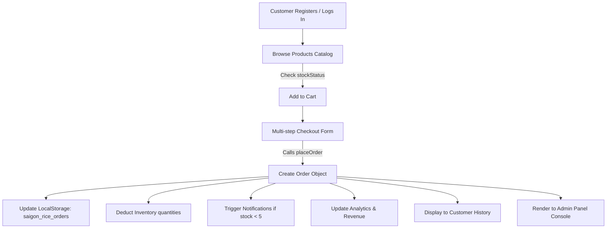

# SAIGON RICE - PREMIUM E-COMMERCE & BUSINESS MANAGEMENT SYSTEM

This document provides a comprehensive technical overview and architecture summary of the **Saigon Rice** web application. Use this document as a reference for academic submissions, system audits, or to feed directly into other AI assistants (like ChatGPT) to help them understand the codebase.

---

## 1. Project Overview & Business Value
**Saigon Rice** is a premium, high-performance web application designed as the official corporate digital presence and e-commerce portal of a leading Vietnamese rice brand. 

Instead of being a visual prototype, the project features a fully functional client-side database layer that simulates a live e-commerce ecosystem, featuring auto-delivery subscriptions, a dynamic checkout funnel, real-time inventory adjustments, and a comprehensive seller administration panel (Shopify/Shopee style).

---

## 2. Technology Stack
*   **Core Framework:** React 18+ (bootstrapped via **Vite** for fast HMR and optimized production bundles).
*   **Styling Engine:** Tailwind CSS & Vanilla Custom CSS. Includes a premium natural color palette (Beige `#faf6ee`, Dark Forest Green `#1b4332`, Accent Yellow `#d4af37`).
*   **Icons Library:** `react-icons` (FontAwesome, Feather, etc.)
*   **Animations:** `framer-motion` for smooth micro-animations, slide-over modals, and transition animations.
*   **Charts Engine:** `recharts` for scalable SVG charts.
*   **Routing System:** `react-router-dom` (handling guest routes, customer-protected dashboards, and admin role-protected sections).

---

## 3. Centralized Architecture & State Layer
To enforce clean code practices and prevent data duplication, the application's backend is simulated using a **decentralized React Context system** that acts as the single source of truth. All changes immediately propagate across components without requiring a browser refresh.

### Context Splitting Map:
1.  **`AuthContext.jsx`:** Manages user sessions, registration, login, and profile edits. Automatically syncs to `saigon_rice_user` and `saigon_rice_all_users`.
2.  **`ProductContext.jsx`:** Manages the products catalog. Allows adding, editing, deleting, and toggling the availability status (`disabled` state) of rice varieties. Syncs to `saigon_rice_products`.
3.  **`OrderContext.jsx`:** Manages all transaction records. Supports status changes and record removals. Syncs to `saigon_rice_orders`.
4.  **`CustomerContext.jsx`:** Allows querying and disabling customer accounts.
5.  **`InventoryContext.jsx`:** Manages stock levels, deducts quantities on purchase, and updates state.
6.  **`NotificationContext.jsx`:** Dispatches real-time warning logs to the admin center. Syncs to `saigon_rice_notifications`.
7.  **`AnalyticsContext.jsx`:** Dynamically aggregates total revenue (only from *Delivered* orders), average order values, and category charts.
8.  **`CartContext.jsx`:** Tracks shopper shopping baskets, applying discounts, VAT (10%), and shipping fees.

*Note: All of these isolated contexts are consolidated and re-exported via **`StoreContext.jsx`** using custom hooks to keep imports clean.*

---

## 4. Database Schema (LocalStorage Collections)

The application structures client-side state inside the browser's LocalStorage under the following JSON schemas:

### `saigon_rice_products` (Array of objects)
```json
{
  "id": "st-25-organic",
  "name": "ST25 Organic Rice",
  "category": "ST Rice",
  "price": 180000,
  "discount": 10,
  "image": "https://...",
  "stock": 42,
  "stockStatus": "In Stock",
  "sales": 18,
  "revenue": 2916000,
  "disabled": false,
  "bagSize": "5kg",
  "tasteProfile": "Soft",
  "origin": "Soc Trang, Vietnam",
  "nutrition": { "calories": "348 kcal", "protein": "7g", "carbs": "78g" }
}
```

### `saigon_rice_orders` (Array of objects)
```json
{
  "id": "SGR-284918",
  "customerName": "Demo Customer",
  "customerEmail": "demo@saigonrice.vn",
  "customerPhone": "0987654321",
  "shippingAddress": "120 Le Loi Street, HCMC",
  "orderDate": "2026-08-03",
  "items": [
    {
      "id": "st-25-organic",
      "name": "ST25 Organic Rice",
      "quantity": 2,
      "price": 180000,
      "discount": 10,
      "bagSize": "5kg"
    }
  ],
  "subtotal": 360000,
  "shippingFee": 30000,
  "tax": 32400,
  "totalAmount": 386400,
  "paymentMethod": "COD",
  "paymentStatus": "Pending",
  "orderStatus": "Pending",
  "createdAt": "2026-08-03T12:00:00.000Z"
}
```

### `saigon_rice_all_users` (Array of objects)
```json
{
  "fullName": "Demo Customer",
  "email": "demo@saigonrice.vn",
  "password": "password123",
  "role": "customer",
  "phone": "0987654321",
  "addresses": ["120 Le Loi Street, HCMC"],
  "disabled": false,
  "registrationDate": "2026-08-01"
}
```

---

## 5. Complete Application Flow & Logic Pipes



1.  **Safety Buffer Validation:** Placing an order decreases stock. If stock drops to `0`, `stockStatus` automatically changes to `Out of Stock`. In the storefront, any product marked as `disabled === true` is filtered out of view, and `Out of Stock` products disable the "Add to Cart" button.
2.  **Revenue Generation Rule:** Revenue is calculated strictly from orders with `orderStatus === "Delivered"`. Active/Pending shipments do not skew completed financial sheets.
3.  **Delivery Tracking Pipeline:** Every order includes a delivery timeline (`Pending` ➔ `Confirmed` ➔ `Preparing` ➔ `Shipping` ➔ `Delivered` ➔ `Cancelled`). Modifying status in the Admin dashboard updates the customer's dashboard tracker in real-time.

---

## 6. Admin Panel Modules
*   **Overview Dashboard:** 15 KPI cards calculated dynamically (Revenue metrics, Order statuses breakdown, Today vs Monthly counts, Catalog alerts).
*   **Order Management:** Lists all orders. Supports search, filter, update status, printable invoice sheets, and exports.
*   **Product Manager:** Full CRUD interface for adding new varieties, setting discounts, editing stock, and disabling products.
*   **Customer registry:** Audit customer profiles, verify total spending, and disable accounts immediately.
*   **Analytics charts:** Graphing data utilizing Recharts (monthly revenue curve, best-selling bars, category pie, status doughnut).

---

## 7. Seed Accounts for testing
For demonstration purposes, these local accounts are initialized by default:

*   **Administrator Account:**
    *   **Email:** `admin@saigonrice.vn`
    *   **Password:** `adminpassword123`
*   **Demo Shopper Account:**
    *   **Email:** `demo@saigonrice.vn`
    *   **Password:** `password123`
